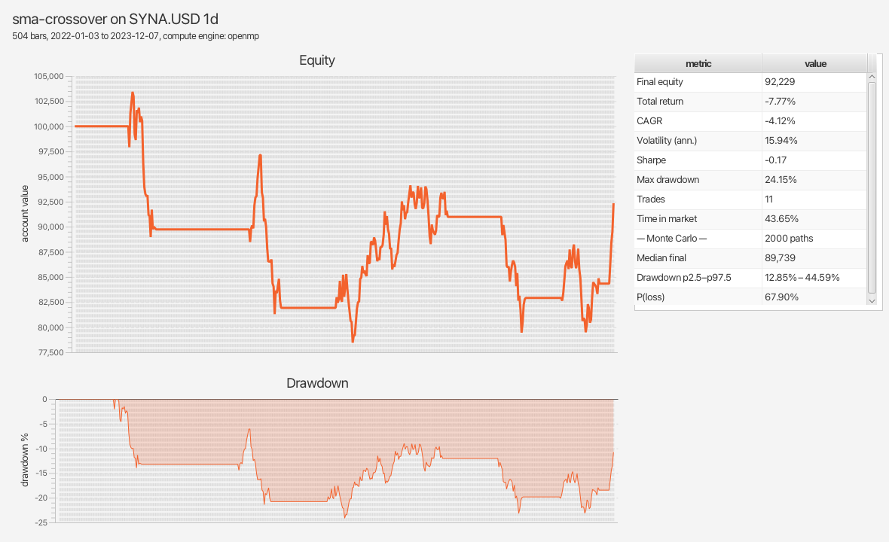
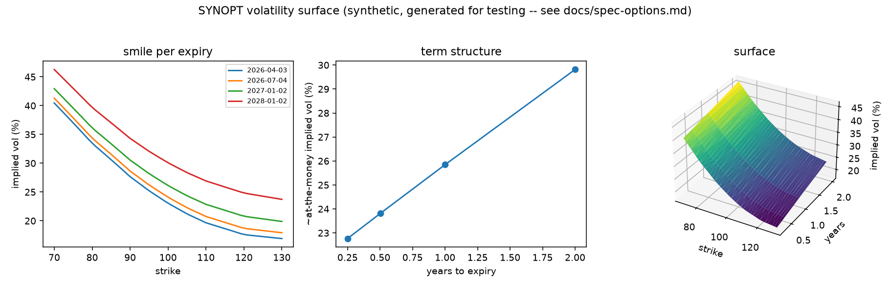
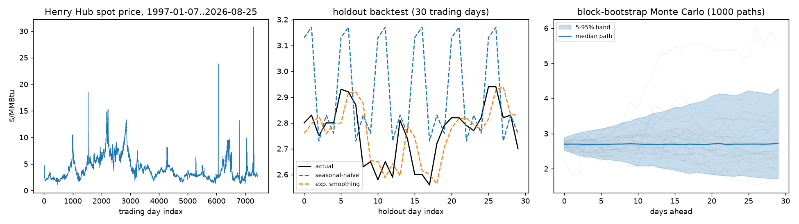
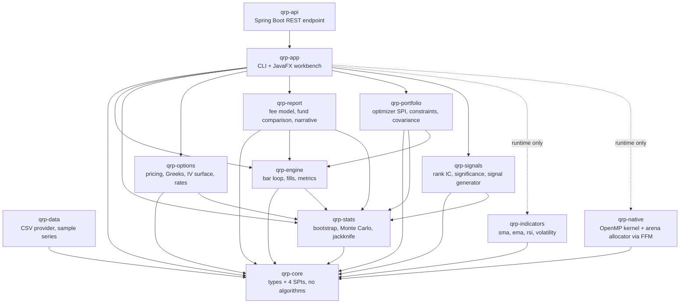

# Quantitative Research Platform — public core

A modular backtesting and indicator platform in Java, with an optional C++/OpenMP
compute kernel and a JavaFX research workbench.

**This repository publishes the structure, not the alpha.** Indicators,
strategies, data providers and compute kernels are plugins discovered at runtime
through `ServiceLoader`. What ships here are public, textbook implementations —
enough to run the whole system end to end from a clean clone — while proprietary
signals stay in a private jar that drops into the same interfaces without a line
of change in this repository.



## Quick start

Needs a JDK 25 and Maven. No accounts, no API keys, no network.

```bash
mvn -q install                                          # build and test everything
mvn -q -pl qrp-app exec:java -Dexec.args="run"          # backtest + report
mvn -q -pl qrp-app exec:java -Dexec.args="workbench"    # the window above
mvn -q -pl qrp-app exec:java -Dexec.args="options"      # price, fit, diagnose a chain
mvn -q -pl qrp-app exec:java -Dexec.args="compare"      # fund comparison + narrative (--narrative=template|ollama)
mvn -q -pl qrp-app exec:java -Dexec.args="portfolio"    # multi-instrument rebalancing (--optimizer=mean-variance|risk-parity)
mvn -q -pl qrp-api spring-boot:run                       # the same backtest, over REST -- see below
```

Optional, for the native compute kernel:

```bash
brew install libomp     # macOS only; Linux gcc already has OpenMP
make -C native          # everything still works without this
```

## What it prints

```
  ------------------------------------------------------------
  sma-crossover on SYNA.USD 1d
  504 bars, 2022-01-03 to 2023-12-07, compute engine: openmp
  ------------------------------------------------------------
  initial equity                                    100,000.00
  final equity                                       92,229.01
  total return                                          -7.77%
  CAGR                                                  -4.12%
  annualised volatility                                 15.94%
  Sharpe ratio                                           -0.17
  max drawdown                                          24.15%
  trades                                                    11
  time in market                                        43.65%
  ------------------------------------------------------------
  Monte Carlo: 2000 resampled paths
  ------------------------------------------------------------
  median final equity                                89,738.96
  final equity (95%)                   61,285.46 .. 130,600.17
  max drawdown (95%)                          12.85% .. 44.59%
  probability of loss                                   67.90%
  ------------------------------------------------------------
  Costs are modelled; financing, borrow and taxes are not.
  Resampled paths reorder the observed returns: they describe this
  strategy on this history, not its behaviour on unseen data.
  ------------------------------------------------------------
```

**The reference strategy loses money, and that is the published result.** A 20/50
moving-average crossover has no edge; tuning its windows until the README looked
better would make every number on this page meaningless. The more useful line is
the last one: resampling the same returns in blocks says that two thirds of the
plausible orderings also lose. One backtest is an anecdote — the distribution
around it is the actual finding.

## Execution models: market-open vs. limit-order-book

The bar loop's fill decision is behind an `ExecutionModel` interface with two
implementations: `MarketOpenExecutionModel` (the platform's original logic —
fills the full requested size at the reference bar's open, plus a flat
`CostModel` concession) and `LimitOrderBookExecutionModel` (rests a limit
order against a synthetic bid/ask book built from that bar's own OHLCV, and
can honestly report a partial fill or no fill when the book's depth does not
support the full size). Same strategy, same data, selected with
`--execution market-open` or `--execution lob`:

```
$ mvn -q -pl qrp-app exec:java -Dexec.args="run --execution=lob"
  ------------------------------------------------------------
  sma-crossover on SYNA.USD 1d
  504 bars, 2022-01-03 to 2023-12-07, compute engine: openmp
  ------------------------------------------------------------
  initial equity                                    100,000.00
  final equity                                       83,338.87
  total return                                         -16.66%
  CAGR                                                  -9.03%
  annualised volatility                                 16.15%
  Sharpe ratio                                           -0.48
  max drawdown                                          28.33%
  trades                                                    11
  time in market                                        43.65%
  ------------------------------------------------------------
  execution: lob
  ------------------------------------------------------------
  fill attempts                                             11
  fills completed                                           11
  fill rate                                            100.00%
  total slippage vs. reference                        8,612.11
  avg. slippage vs. reference                        94.33 bps
  ------------------------------------------------------------
  Monte Carlo: 2000 resampled paths
  ------------------------------------------------------------
  median final equity                                81,958.35
  final equity (95%)                   56,758.35 .. 119,089.00
  max drawdown (95%)                          14.64% .. 47.83%
  probability of loss                                   82.15%
  ------------------------------------------------------------
  Costs are modelled; financing, borrow and taxes are not.
  Resampled paths reorder the observed returns: they describe this
  strategy on this history, not its behaviour on unseen data.
  ------------------------------------------------------------
```

Same strategy and data as the plain `run` above, but a visibly different
outcome: the synthetic book's spread and depth cost this run about 94 bps of
average slippage against the reference price, versus the flat 2 bps
`CostModel.retail()` concession the market-open run above pays no matter what
the bar looked like. See [`docs/spec-execution.md`](docs/spec-execution.md)
for the `ExecutionModel` interface, both implementations, how the synthetic
book is built from a bar's OHLCV, and its stated limitations.

## Options: pricing, Greeks, implied volatility, the surface

```
  ------------------------------------------------------------
  volatility surface: SYNOPT, valued 2026-01-02
  36 quotes, 4 expiries, 9 strikes
  ------------------------------------------------------------
  strike      2026-04-03  2026-07-04  2027-01-02  2028-01-02
  70.00           40.46%      41.29%      42.95%      46.28%
  100.00          23.05%      24.09%      26.12%      30.08%
  130.00          16.91%      17.93%      19.89%      23.73%
  ------------------------------------------------------------
  no-arbitrage diagnostics: clean
  ------------------------------------------------------------
  Vol is interpolated in total variance from a chain that discounts each
  quote at its own flat rate; RatesCurve exists (qrp-options) but is not
  wired into this surface's IV solving yet.
  Surface fit does not extrapolate past the quoted strikes or expiries.
  ------------------------------------------------------------
```

`qrp-options` prices European and American options through three
cross-validated engines -- Black-Scholes-Merton with analytic Greeks,
Cox-Ross-Rubinstein binomial trees, and antithetic-variate Monte Carlo -- fits
an implied volatility surface from a chain, checks it for the three static
no-arbitrage conditions that need no model (butterfly convexity, calendar
monotonicity in total variance, put-call parity), and discounts against a real
US Treasury constant-maturity curve, `RatesCurve`, carrying duration, DV01 and
convexity.



*Rendered by `tools/plot_surface.py` from a CSV `qrp options --export` writes
-- run `mvn -q -pl qrp-app exec:java -Dexec.args="options --export /tmp/grid.csv"`
then `python3 tools/plot_surface.py /tmp/grid.csv docs/vol-surface.png`.*

The chain is **synthetic**, `SYNOPT`, generated from a known, hand-specified
volatility function -- a quadratic in log-moneyness with a sloped
at-the-money level, explicitly not claimed to be a real SVI parameterization.
That is what makes `VolatilitySurfaceTest`'s headline check possible: the
surface is refit from only the resulting market prices, with no access to the
generating function, and the test asserts it recovers the function it was
generated from at every quoted grid point, to 1e-6. See
[`docs/spec-options.md`](docs/spec-options.md) for the module's design
decisions (D1-D9), including why carry is expressed as a dividend yield
rather than a cost-of-carry parameter, why the degenerate zero-volatility case
is priced rather than rejected, and why `BondAnalytics` uses continuous
compounding instead of the bond-market bond-equivalent convention.

## Fund comparison: fees, risk-ranked returns, a plain-English narrative

```
$ mvn -q -pl qrp-app exec:java -Dexec.args="compare"
  ----------------------------------------------------------------------------
  fund comparison: SYNA, SYNB vs. SYNETF
  strategy: sma-crossover, benchmark: SYNETF
  ----------------------------------------------------------------------------
  fund                  gross        net   sharpe     max dd    VaR95     ES95    vs. bench
  ----------------------------------------------------------------------------
  SYNA                 -4.12%     -6.10%    -0.17     24.15%    2.11%    2.67%     -605 bps
  SYNB                -27.49%    -29.00%    -1.38     56.33%    2.61%    3.70%    -2894 bps
  SYNETF (bench)       +0.04%     -0.06%    +0.04      6.97%    0.90%    1.30%           --
  ----------------------------------------------------------------------------
  Ranked by net CAGR, highest first; the benchmark row always prints
  last regardless of rank. "vs. bench" is the net-CAGR gap in basis
  points, positive meaning this fund beat the benchmark net of its own
  fee. Fees are a single flat annual rate (see ManagementFeeModel); a
  real fund's MER is neither flat nor uniform across share classes.
  ----------------------------------------------------------------------------
  [template summary] SYNA posted the strongest net-of-fee return in this
  comparison, at -6.10% annualized. SYNA also delivered the best
  risk-adjusted return, with a Sharpe ratio of -0.17, so the same fund led
  on both measures. SYNA trailed the SYNETF benchmark by 605 bps net of
  fees.
  ----------------------------------------------------------------------------
```

`qrp-report` reuses the engine's own gross CAGR, Sharpe and max drawdown for
`SYNA`, `SYNB` and the passive `SYNETF` benchmark, rather than recomputing
them, and adds the two figures the engine does not produce: a fee-adjusted
net CAGR (`ManagementFeeModel` applies a flat annual rate to the equity
curve, exact regardless of bar frequency) and historical 95% VaR/expected
shortfall on the gross return series. Rows are ranked by net CAGR; the
benchmark row always prints last, whatever its rank, and every candidate's
"vs. bench" column is the net-CAGR gap to it in basis points.

The closing paragraph is written by a `NarrativeGenerator`. The default,
`TemplateNarrativeGenerator`, is a deterministic rule over the table's own
numbers — no network, always available, and it finds the net-CAGR leader and
the Sharpe leader independently, so it says so explicitly on the (real, in
this run) case where the top net performer is not the steadiest one.
`--narrative=ollama` swaps in `OllamaNarrativeGenerator`, which prompts a
local Ollama server (`http://localhost:11434`, model `llama3.2`, JDK
`HttpClient` only — no new dependency) and labels its output
`[AI-generated summary]`; on any failure — server not running, timeout, a
malformed response — it fails closed to the template's own labelled output
rather than throwing or silently claiming AI wrote something it didn't. Same
honest-fallback pattern as the RAG copilot in `mortality-copilot`. See
[`docs/spec-report.md`](docs/spec-report.md) for the fee model, the table,
and both narrative generators' design decisions (D1-D7).

## Portfolio construction: multi-instrument rebalancing under constraints

```
$ mvn -q -pl qrp-app exec:java -Dexec.args="portfolio --optimizer=risk-parity"
  ------------------------------------------------------------
  portfolio: SYNA, SYNB, SYNETF
  optimizer: equal-risk-contribution, rebalance: monthly
  ------------------------------------------------------------
  initial equity                                    100,000.00
  final equity                                       74,144.67
  total return                                         -25.86%
  rebalances                                                22
  total turnover                                        1.6775
  ------------------------------------------------------------
  instrument          avg. weight avg. risk contribution
  ------------------------------------------------------------
  SYNA                     30.14%               0.000019
  SYNB                     20.15%               0.000020
  SYNETF                   49.70%               0.000017
  ------------------------------------------------------------
  Weight and risk contribution are averaged across every scheduled
  rebalance. Risk contribution is w_i * (Sigma w)_i, the same quantity
  the risk-parity optimizer targets directly and mean-variance reports
  as a byproduct of its own objective; it sums to the
  portfolio's variance at each rebalance, not to 1. Turnover is the
  sum of |weight change| across every instrument and rebalance -- the
  same quantity a turnover cap bounds -- not measured from the literal
  fills the per-instrument composition happens to make. Every sleeve
  is priced through the existing single-instrument engine and its cost
  model; there is no covariance shrinkage and no transaction-cost
  optimization beyond the turnover cap. There is no factor model:
  the view above is a flat trailing-momentum placeholder, not an
  estimated forecast.
  ------------------------------------------------------------
```

`qrp-portfolio` is the platform's one module that allocates capital *across*
instruments rather than sizing one at a time. A `PortfolioOptimizer` SPI takes
per-instrument expected-return views, a covariance matrix and a
`PortfolioConstraints` (max weight, max turnover, leverage, optional sector
caps) and returns target weights; two independent implementations sit behind
it. `MeanVarianceOptimizer` trades expected return off against variance via
projected gradient descent, matching the closed-form two-asset answer when
nothing binds. `EqualRiskContributionOptimizer` ("risk parity") ignores
expected return entirely and instead equalizes each instrument's contribution
to portfolio variance via cyclical coordinate descent, converging to the
closed-form inverse-volatility weights on a diagonal covariance matrix.
`CovarianceEstimator` builds the covariance matrix from `JackknifeCorrelation`
— the same pairwise correlation tool the platform already uses to judge
whether a signal is real — so the correlation used to size a bet and the
covariance used to judge whether it's real can never quietly disagree.

`PortfolioBacktestEngine` rebalances several instruments on a schedule
(`--rebalance monthly|weekly`) by composing the *existing, unmodified*
single-instrument `BacktestEngine` per instrument per rebalance segment,
rather than duplicating its fill logic — so this extension changed zero
`qrp-engine` files, and the `BacktestIntegrationTest` golden run below is
untouched by it. `qrp portfolio` selects the optimizer
(`--optimizer mean-variance|risk-parity`), the schedule, the covariance
lookback window, the constraints, and prints target weights, realized risk
contribution per instrument, and total turnover — not just an aggregate
equity curve. See [`docs/spec-portfolio.md`](docs/spec-portfolio.md) for the
SPI, both optimizers' design decisions (D1-D9), and stated limitations: no
covariance shrinkage, no transaction-cost optimization beyond the turnover
cap, and synthetic series only. The "no factor model" limitation from earlier
revisions is now `--signal`, below — `expectedReturns` can be estimated
instead of hand-supplied, though only from one indicator at a time.

## Signal generation: cross-sectional forecasts with IC significance testing

```
$ mvn -q -pl qrp-app exec:java -Dexec.args="portfolio --optimizer=mean-variance --signal=rsi"
  ------------------------------------------------------------
  portfolio: SYNA, SYNB, SYNETF
  optimizer: mean-variance, rebalance: monthly
  ------------------------------------------------------------
  signal: rsi (485 periods)
  mean IC: +0.0278   std. error: 0.0310   z: +0.897   p: 0.3695   significant at 5%: no
  ------------------------------------------------------------
  initial equity                                    100,000.00
  final equity                                       54,720.76
  total return                                         -45.28%
  rebalances                                                22
  total turnover                                       16.0000
  ------------------------------------------------------------
  instrument          avg. weight avg. risk contribution
  ------------------------------------------------------------
  SYNA                     31.82%               0.000034
  SYNB                     31.82%               0.000083
  SYNETF                   36.36%               0.000013
  ------------------------------------------------------------
```

`qrp-signals` is the first module that *estimates* `PortfolioOptimizer`'s
`expectedReturns` argument instead of taking it as a caller-supplied
placeholder. `CrossSectionalSignalGenerator` takes one `Indicator` (any of
`qrp-indicators`' shipped ones, discovered the same way the `list` command
already discovers them) and, at every bar, rank-transforms its output across
the instrument universe, centers the ranks so the middle one forecasts zero,
and scales them linearly to a caller-chosen spread — the gap between the
most- and least-favoured instrument's forecast that bar. Ranking rather than
reading the raw value matters because not every indicator's output is
comparable across instruments at face value: a simple moving average is in
price units, and a $500 instrument's SMA is not "more bullish" than a $50
one's just for being a bigger number. RSI, used above, is bounded `[0, 100]`
and genuinely comparable, which is why the golden-run test scores it rather
than a raw moving average.

Producing a forecast is the easy half. `InformationCoefficient` scores it:
the Spearman rank correlation between the forecast and the forward return it
was trying to predict, one value per period, computed by rank-transforming
both series and reusing `JackknifeCorrelation.correlation` — the platform's
one Pearson-correlation implementation — rather than a second correlation
formula. `SignalSignificance` then tests whether the *mean* IC across every
period is distinguishable from zero: a large-sample z-approximation (the
platform has no Student's-t implementation and this module does not add
one), reported honestly even when the answer is "no," which the transcript
above is — RSI on three geometric Brownian series has no reason to carry
real predictive information, and p = 0.37 says exactly that. `qrp portfolio
--signal <indicator-id>` runs both halves together: the generated forecast
drives the allocation (`MeanVarianceOptimizer` uses it directly;
`EqualRiskContributionOptimizer` ignores it, same as the flat placeholder
view), and the IC/significance line prints alongside the allocation report so
a reviewer sees whether the thing driving it is worth trusting before reading
the backtest it produced. See
[`docs/spec-signals.md`](docs/spec-signals.md) for the full design and stated
limitations: single indicator per signal, no multi-factor combination, no
transaction-cost-aware signal decay, and the z-approximation's small-sample
caveat.

## Commodities: real Henry Hub natural gas data, SQL, forecasting and Monte Carlo

```
$ python3 tools/energy_db.py data/energy/henry_hub_2026-08-29.csv /tmp/energy.db
skipped 1 row(s) with no reported price
loaded /tmp/energy.db: 7441 rows in prices
$ python3 tools/forecast_energy.py /tmp/energy.db docs/energy-forecast.png
seasonal-naive:        MAE=0.1910  RMSE=0.2564
exp. smoothing (a=0.90): MAE=0.0684  RMSE=0.0925
winner on this holdout: exponential smoothing
Monte Carlo 30-day-ahead median final price: 2.72 (5-95%: 1.73..4.28)
wrote docs/energy-forecast.png
```

Every other series in this repository is synthetic (`SYNA`/`SYNB`/`SYNETF`,
`SYNOPT`) and no module has ever used a database. `tools/energy_db.py` loads
a real, public commodity price series -- the EIA's daily Henry Hub natural
gas spot price, fetched with no API key by `tools/fetch_energy_prices.py` --
into SQLite, with a tested load/query layer (`tools/test_energy_db.py`).
`tools/forecast_energy.py` backtests two one-step-ahead forecasting
baselines (seasonal-naive, simple exponential smoothing) against a real
30-day holdout and reports whichever wins, then runs a block-bootstrap
Monte Carlo simulation of future price paths over the real historical
log-returns -- the same moving-block resampling idea `qrp-stats`'s Java
Monte Carlo already uses, applied here to a commodity instead of a
synthetic equity series.



*Rendered by `tools/forecast_energy.py` -- see the two commands above.*

See [`docs/spec-commodities.md`](docs/spec-commodities.md) for the schema,
the backtest methodology, and what is deliberately not here (no futures
curve, no weather data, no real-time feed).

## REST API: a third front end over the same backtest, and the fund comparison report

```
$ mvn -q -pl qrp-api spring-boot:run &
$ curl -s -X POST localhost:8080/api/runs -H 'Content-Type: application/json' -d '{}'
{"strategyId":"sma-crossover","engineId":"openmp","executionId":"market-open",
 "initialEquity":100000.0,"finalEquity":92229.0094522352,
 "totalReturn":-0.077709905477648,"cagr":-0.04115895776844469,
 "annualisedVolatility":0.15940362521662213,"sharpeRatio":-0.174514427227237,
 "maxDrawdown":0.24149473488945833,"tradeCount":11,
 "timeInMarket":0.4365079365079365,
 "equityCurve":[100000.0,100000.0, ... 502 values ..., 92229.0094522352]}

$ curl -s -X POST localhost:8080/api/runs -H 'Content-Type: application/json' -d '{"symbol":"NOPE"}'
{"message":"unknown symbol 'NOPE'; available: [SYNA, SYNB, SYNETF]"}
```

`qrp-api` is a Spring Boot module exposing `POST /api/runs`, alongside the
CLI and the JavaFX workbench as a third caller of the same
`BacktestRunner.run` the other two already share. The controller's only job
is translating a JSON request into the exact `--flag value` list
`CliArguments.parse` already accepts, then handing the parsed record to the
unmodified runner — so every default (`sma-crossover` at `fast=20`/`slow=50`
when no strategy is named, `market-open` execution, `retail` costs) and
every validation rule (an unknown symbol, `fast >= slow`, a negative
`--paths`) is the CLI's own, not a second copy of the same rules. An empty
request body reproduces `qrp run`'s own zero-flag output byte for byte,
including the golden-run numbers `BacktestIntegrationTest` and `QrpCliTest`
already pin: one engine, three front ends, the same answer. A bad request
(an unavailable symbol, an invalid strategy parameter) returns `400` with
the CLI's own error message as JSON rather than a stack trace. See
[`docs/spec-api.md`](docs/spec-api.md) for the full design and stated
limitations: no authentication, no persistence, no data-directory override
from the request body.

A second endpoint puts the [fund comparison report](#fund-comparison-fees-risk-ranked-returns-a-plain-english-narrative)
behind the same module, AI narrative included:

```
$ curl -s localhost:8080/api/reports/compare
{"strategyId":"sma-crossover","candidateSymbols":["SYNA","SYNB"],"benchmarkSymbol":"SYNETF",
 "rows":[
   {"displayName":"SYNA","netCagr":-0.061038983750053344,"sharpeRatio":-0.174514427227237,
    "maxDrawdown":0.24149473488945833,"benchmarkRelativeBps":-604.6589158938831, ...},
   {"displayName":"SYNB","netCagr":-0.2899657957563877, ...},
   {"displayName":"SYNETF","isBenchmark":true,"benchmarkRelativeBps":0.0, ...}],
 "narrative":"[template summary] SYNA posted the strongest net-of-fee return in this
 comparison, at -6.10% annualized. SYNA also delivered the best risk-adjusted return,
 with a Sharpe ratio of -0.17, so the same fund led on both measures. SYNA trailed the
 SYNETF benchmark by 605 bps net of fees."}
```

`ReportController` (`GET /api/reports/compare`) is a second caller of an
existing entry point, the same pattern as `RunController`: query parameters
map onto `CompareArguments`' own flags, the controller hands the parsed
record to the unmodified `CompareRunner.run`, and every number — including
the narrative text — comes from `qrp-report`, not from anything reimplemented
in the controller. `?narrative=ollama` behaves exactly as the CLI's own
`--narrative=ollama` does, fail-closed included. See
[`docs/spec-api.md`](docs/spec-api.md) (R6-R9, D6-D8) for the full design.

## Architecture



The dotted edges are the point: `qrp-app` never imports an indicator or a compute
kernel, and `qrp-engine` carries `qrp-indicators` as a *test* dependency only —
its reference strategy resolves `sma` through the registry at runtime, so the
module never compiles against an implementation. The plugin
boundary is enforced by the build rather than described in a document.

| Module | What it holds | Spec |
| --- | --- | --- |
| `qrp-core` | `Bar`, `BarSeries`, `Instrument`, `Params`, `Signal`, the four SPIs, the plugin registry | [spec](docs/spec-core.md) |
| `qrp-data` | CSV provider, manifest format, synthetic sample generator | [spec](docs/spec-data.md) |
| `qrp-indicators` | SMA, EMA, RSI, rolling volatility, DuPont, CPI real-price adjuster | [spec](docs/spec-indicators.md) |
| `qrp-engine` | Event-driven bar loop, cost model, portfolio accounting, metrics, pluggable `ExecutionModel` (market-open, limit-order-book) | [spec](docs/spec-engine.md), [spec](docs/spec-execution.md) |
| `qrp-stats` | Block bootstrap, Monte Carlo paths, jackknife correlation, VaR/ES | [spec](docs/spec-stats.md) |
| `qrp-options` | Black-Scholes-Merton, binomial trees, Monte Carlo, implied vol, the surface, no-arbitrage diagnostics, the Treasury curve | [spec](docs/spec-options.md) |
| `qrp-report` | `ManagementFeeModel`, `FundComparisonTable` (fee-adjusted, risk-ranked returns vs. a benchmark), template and optional-Ollama `NarrativeGenerator` | [spec](docs/spec-report.md) |
| `qrp-portfolio` | `PortfolioOptimizer` SPI, `PortfolioConstraints`, `CovarianceEstimator`, `MeanVarianceOptimizer`, `EqualRiskContributionOptimizer`, `PortfolioBacktestEngine` (scheduled multi-instrument rebalancing over the existing single-instrument engine) | [spec](docs/spec-portfolio.md) |
| `qrp-signals` | `RankTransform`, `InformationCoefficient` (Spearman rank IC), `SignalSignificance` (z-test over an IC series), `CrossSectionalSignalGenerator` (one indicator's cross-sectional rank into an `expectedReturns` forecast) | [spec](docs/spec-signals.md) |
| `qrp-native` | C++17 + OpenMP kernel bound through the foreign function API; `ArenaAllocator` (mmap-backed) and `MallocAllocator` behind the identical interface, backing the block-bootstrap median kernel's per-draw scratch buffer | [runbook](docs/runbook.md), [spec](docs/spec-memory.md) |
| `qrp-app` | `run` / `list` / `workbench` / `options` / `compare` / `portfolio` | [spec](docs/spec-app.md) |
| `qrp-api` | Spring Boot `POST /api/runs` and `GET /api/reports/compare` -- the CLI's own `CliArguments`/`BacktestRunner` and `CompareArguments`/`CompareRunner`, over HTTP | [spec](docs/spec-api.md) |

## What is deliberately not here

- **Proprietary indicators and signals.** Six public reference implementations
  ship; the private ones arrive as a separate jar through the same SPI.
- **The live broker path.** `MarketDataProvider` is the contract; a
  broker-backed implementation needs credentials, a gateway and a market data
  subscription that no reviewer cloning this has.
- **Vendor price history.** The bundled series are seeded geometric Brownian
  motion, named `SYNA`, `SYNB`, `SYNETF` so nobody mistakes a demo for a
  backtest on real prices. Regenerate them byte for byte with
  `mvn -pl qrp-data exec:java`.
- **A real option chain.** `SYNOPT` is synthetic, priced from a known
  volatility function and labelled as such; a vendor chain feed is an
  `OptionChainProvider` implementation point, same pattern as market data.
- **A reconstructed real order book.** `LimitOrderBookExecutionModel` fills
  against `SyntheticOrderBook`, a heuristic built from a single bar's own
  OHLCV — spread and depth derived from the bar's range and volume, not from
  tick-by-tick quotes or a real limit order feed, because this data set has
  no such feed. It answers "would a plausible book have supported this
  size," not "what did the book actually look like." See
  `docs/spec-execution.md`.
- **Stochastic volatility, exotics, a par-to-zero bootstrap.** See
  `docs/spec-options.md`'s "Not here, deliberately" section for the full list.
- **A live fund or pricing data feed.** `compare` runs the same synthetic
  `SYNA`/`SYNB`/`SYNETF` series every other command uses; there is no vendor
  fund-pricing or NAV feed behind it.
- **Real MERs.** `ManagementFeeModel`'s rates (2% candidate, 9 bps benchmark)
  are a synthetic fee schedule chosen to be plausible, not sourced from any
  actual fund's fact sheet or prospectus.
- **Regulatory or prospectus compliance checking.** The comparison table and
  its narrative are a research/sales-support artifact, not a NI 81-102 or
  point-of-sale disclosure check; nothing here validates that a comparison
  would be permitted to leave the building as-is.
- **Covariance shrinkage or transaction-cost-aware optimization.**
  `qrp-portfolio`'s `CovarianceEstimator` is a plain sample estimator (no
  Ledoit-Wolf or similar shrinkage), and a rebalance either fits inside the
  turnover cap or it does not — there is no cost-aware trade-off search
  beyond that cap. See `docs/spec-portfolio.md`.
- **Multi-factor signal combination.** `qrp-signals`' `CrossSectionalSignalGenerator`
  takes exactly one indicator per signal; there is no factor blending, no
  orthogonalization, and no transaction-cost-aware signal decay. The IC
  significance test is a large-sample z-approximation, not a small-sample
  Student's-t test. See `docs/spec-signals.md`.
- **Authentication, persistence and streaming in `qrp-api`.** Every request
  — a backtest run or a fund comparison report — is stateless with no notion
  of a caller identity; nothing is stored, there is no way to re-fetch a past
  run or report by ID, and a long equity curve is returned as one JSON array
  rather than paginated or streamed. See `docs/spec-api.md`.
- **A free-list in either native allocator.** `ArenaAllocator` and
  `MallocAllocator` can only be reset as a whole, never partially reclaimed;
  neither is thread-safe to share across threads without external
  synchronization. `perf`/`valgrind` cache-line and TLB-level profiling is
  also not here — neither tool is available on Apple Silicon macOS, so
  `/usr/bin/time -l` resource-usage counters stand in instead. See
  `docs/spec-memory.md`.

## Engineering notes

**Look-ahead is prevented by the type, not by a rule.** `Strategy.onBar` receives
a `BarSeries` view that ends at the bar being decided (`visibleAt(i)`, backed by
`List.subList`, so it costs no copy). A strategy author cannot read tomorrow's
close by accident, because it is not in the object they were handed. The engine
then fills at the *next* bar's open: a decision taken on a close could not have
been executed at that close, and the earliest honest fill is the next print. One
consequence is that the target stated on the final bar is never executed, which
is correct rather than an off-by-one.

**The random generator is specified, not inherited.** `SplitMix64` is
transcribed into both Java and C++ with the published constants, and each
bootstrap draw is seeded from its own index rather than from a shared stream.
That is what makes two claims testable at once: the parallel and sequential Java
paths agree bit for bit regardless of thread scheduling, and so does the OpenMP
kernel — `assertArrayEquals(..., 0.0)`, no tolerance, across four block sizes,
five seeds and four draw counts. Selecting a compute engine cannot change a
research result.

**The native kernel is slower than the Java one, and the README says so.**
Measured on an Apple M-series laptop, 10 OpenMP threads, 2,000 observations:

| draws | java, 1 thread | java, parallel | openmp | vs 1 thread | vs parallel |
| --- | --- | --- | --- | --- | --- |
| 1,000 | 1.0 ms | 0.3 ms | 0.2 ms | 3.85x | 1.05x |
| 10,000 | 9.3 ms | 1.5 ms | 1.6 ms | 5.73x | **0.91x** |
| 100,000 | 92.4 ms | 14.6 ms | 15.9 ms | 5.80x | **0.91x** |

C++ beats single-threaded Java by about 5.8x and does not beat Java's parallel
streams. Both parallelise the same outer loop, the JIT compiles the inner
summation about as well as `-O3` does, and the foreign-call boundary costs a
little on top. Quoting "5.8x faster than Java" while comparing against one thread
would be a benchmark that survives exactly until someone reruns it. The kernel
stays because exact agreement across a language boundary is a stronger statement
about the architecture than a speedup would have been — and if the inner loop
ever becomes something the JIT handles badly, the seam is already in place.

**A fund comparison's fee is one flat annual rate, not the structure a real
Canadian mutual fund actually charges.** `ManagementFeeModel` applies a single
constant MER, compounded per bar so the annual rate is exact regardless of
timeframe (`docs/spec-report.md`, R1). An actual fund's cost is not that
simple: MERs are tiered by share class (A-series vs. F-series vs.
institutional), often bundle a trailing commission paid back to the dealer of
record, and can be waived or capped below the stated rate at scale. Collapsing
all of that into one number is deliberate — it isolates the effect of a
return-drag fee from every other structural difference between funds, which
is what the comparison is trying to show — but it means `net CAGR` in this
report answers "what would this fee alone have cost," not "what an investor
in a specific real share class actually paid."

## Testing

`mvn verify` runs 452 tests. Three of them carry more weight than the rest:

- **`IndicatorContractTest`** reads `META-INF/services`, asserts the registry
  discovered exactly those providers, then holds every discovered indicator to
  the SPI contract — one value per bar, nothing defined inside its declared
  warm-up, deterministic across calls. A private indicator dropped on the
  classpath is held to the same rules without editing the test.
- **`BacktestIntegrationTest`** pins one run end to end across all modules. The
  numbers are a characterisation: change the fill timing, the share rounding or
  the cost model and it fails, instead of silently restating every published
  result.
- **`NativeComputeEngineTest`** is the exact-equality suite above. On a machine
  with no C++ toolchain it skips and prints why, so an unbuilt kernel never
  passes as though it had been checked.

CI runs on Ubuntu and macOS, builds the native kernel with `continue-on-error`,
and therefore exercises both the fast path and the degraded one.

## Limitations

A backtest from this platform models fills, commission and slippage. It does not
model financing, short borrow, taxes, corporate actions, or an order's life after
it is filled, and it runs one instrument at a time. Nothing here corrects for the
number of strategies tried before one looked good, which is the largest source of
false results in backtest research and cannot be fixed inside a single run.

## Licence

MIT — see [LICENSE](LICENSE).
