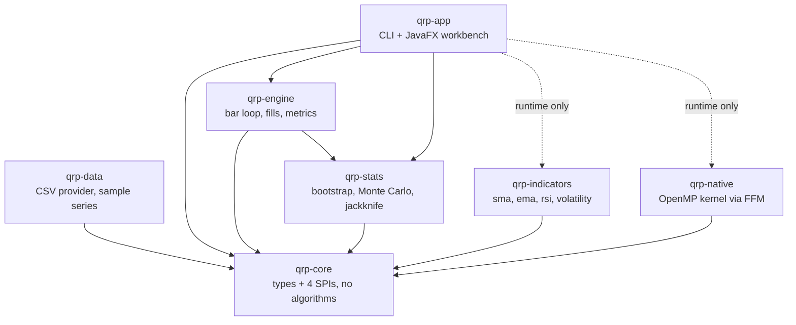

# Quantitative Research Platform — public core

A modular backtesting and indicator platform in Java, with an optional C++/OpenMP
compute kernel and a JavaFX research workbench.

**This repository publishes the structure, not the alpha.** Indicators,
strategies, data providers and compute kernels are plugins discovered at runtime
through `ServiceLoader`. What ships here are public, textbook implementations —
enough to run the whole system end to end from a clean clone — while proprietary
signals stay in a private jar that drops into the same interfaces without a line
of change in this repository.


## Quick start

Needs a JDK 25 and Maven. No accounts, no API keys, no network.

```bash
mvn -q install                                          # build and test everything
mvn -q -pl qrp-app exec:java -Dexec.args="run"          # backtest + report
mvn -q -pl qrp-app exec:java -Dexec.args="workbench"    # the window above
```

Optional, for the native compute kernel:

```bash
brew install libomp     # macOS only; Linux gcc already has OpenMP
make -C native          # everything still works without this
```

## What it prints

```
  ------------------------------------------------------------
  sma-crossover on SYNA.USD 1d
  504 bars, 2022-01-03 to 2023-12-07, compute engine: openmp
  ------------------------------------------------------------
  initial equity                                    100,000.00
  final equity                                       92,229.01
  total return                                          -7.77%
  CAGR                                                  -4.12%
  annualised volatility                                 15.94%
  Sharpe ratio                                           -0.17
  max drawdown                                          24.15%
  trades                                                    11
  time in market                                        43.65%
  ------------------------------------------------------------
  Monte Carlo: 2000 resampled paths
  ------------------------------------------------------------
  median final equity                                89,738.96
  final equity (95%)                   61,285.46 .. 130,600.17
  max drawdown (95%)                          12.85% .. 44.59%
  probability of loss                                   67.90%
  ------------------------------------------------------------
  Costs are modelled; financing, borrow and taxes are not.
  Resampled paths reorder the observed returns: they describe this
  strategy on this history, not its behaviour on unseen data.
  ------------------------------------------------------------
```

**The reference strategy loses money, and that is the published result.** A 20/50
moving-average crossover has no edge; tuning its windows until the README looked
better would make every number on this page meaningless. The more useful line is
the last one: resampling the same returns in blocks says that two thirds of the
plausible orderings also lose. One backtest is an anecdote — the distribution
around it is the actual finding.

## Architecture



The dotted edges are the point: `qrp-app` never imports an indicator or a compute
kernel, and `qrp-engine` carries `qrp-indicators` as a *test* dependency only —
its reference strategy resolves `sma` through the registry at runtime, so the
module never compiles against an implementation. The plugin
boundary is enforced by the build rather than described in a document.

| Module | What it holds | Spec |
| --- | --- | --- |
| `qrp-core` | `Bar`, `BarSeries`, `Instrument`, `Params`, `Signal`, the four SPIs, the plugin registry | [spec](docs/spec-core.md) |
| `qrp-data` | CSV provider, manifest format, synthetic sample generator | [spec](docs/spec-data.md) |
| `qrp-indicators` | SMA, EMA, RSI, rolling volatility, DuPont, CPI real-price adjuster | [spec](docs/spec-indicators.md) |
| `qrp-engine` | Event-driven bar loop, cost model, portfolio accounting, metrics | [spec](docs/spec-engine.md) |
| `qrp-stats` | Block bootstrap, Monte Carlo paths, jackknife correlation, VaR/ES | [spec](docs/spec-stats.md) |
| `qrp-native` | C++17 + OpenMP kernel bound through the foreign function API | [runbook](docs/runbook.md) |
| `qrp-app` | `run` / `list` / `workbench` | [spec](docs/spec-app.md) |

## What is deliberately not here

- **Proprietary indicators and signals.** Six public reference implementations
  ship; the private ones arrive as a separate jar through the same SPI.
- **The live broker path.** `MarketDataProvider` is the contract; a
  broker-backed implementation needs credentials, a gateway and a market data
  subscription that no reviewer cloning this has.
- **Vendor price history.** The bundled series are seeded geometric Brownian
  motion, named `SYNA`, `SYNB`, `SYNETF` so nobody mistakes a demo for a
  backtest on real prices. Regenerate them byte for byte with
  `mvn -pl qrp-data exec:java`.

## Engineering notes

**Look-ahead is prevented by the type, not by a rule.** `Strategy.onBar` receives
a `BarSeries` view that ends at the bar being decided (`visibleAt(i)`, backed by
`List.subList`, so it costs no copy). A strategy author cannot read tomorrow's
close by accident, because it is not in the object they were handed. The engine
then fills at the *next* bar's open: a decision taken on a close could not have
been executed at that close, and the earliest honest fill is the next print. One
consequence is that the target stated on the final bar is never executed, which
is correct rather than an off-by-one.

**The random generator is specified, not inherited.** `SplitMix64` is
transcribed into both Java and C++ with the published constants, and each
bootstrap draw is seeded from its own index rather than from a shared stream.
That is what makes two claims testable at once: the parallel and sequential Java
paths agree bit for bit regardless of thread scheduling, and so does the OpenMP
kernel — `assertArrayEquals(..., 0.0)`, no tolerance, across four block sizes,
five seeds and four draw counts. Selecting a compute engine cannot change a
research result.

**The native kernel is slower than the Java one, and the README says so.**
Measured on an Apple M-series laptop, 10 OpenMP threads, 2,000 observations:

| draws | java, 1 thread | java, parallel | openmp | vs 1 thread | vs parallel |
| --- | --- | --- | --- | --- | --- |
| 1,000 | 1.0 ms | 0.3 ms | 0.2 ms | 3.85x | 1.05x |
| 10,000 | 9.3 ms | 1.5 ms | 1.6 ms | 5.73x | **0.91x** |
| 100,000 | 92.4 ms | 14.6 ms | 15.9 ms | 5.80x | **0.91x** |

C++ beats single-threaded Java by about 5.8x and does not beat Java's parallel
streams. Both parallelise the same outer loop, the JIT compiles the inner
summation about as well as `-O3` does, and the foreign-call boundary costs a
little on top. Quoting "5.8x faster than Java" while comparing against one thread
would be a benchmark that survives exactly until someone reruns it. The kernel
stays because exact agreement across a language boundary is a stronger statement
about the architecture than a speedup would have been — and if the inner loop
ever becomes something the JIT handles badly, the seam is already in place.

## Testing

`mvn verify` runs 202 tests. Three of them carry more weight than the rest:

- **`IndicatorContractTest`** reads `META-INF/services`, asserts the registry
  discovered exactly those providers, then holds every discovered indicator to
  the SPI contract — one value per bar, nothing defined inside its declared
  warm-up, deterministic across calls. A private indicator dropped on the
  classpath is held to the same rules without editing the test.
- **`BacktestIntegrationTest`** pins one run end to end across all modules. The
  numbers are a characterisation: change the fill timing, the share rounding or
  the cost model and it fails, instead of silently restating every published
  result.
- **`NativeComputeEngineTest`** is the exact-equality suite above. On a machine
  with no C++ toolchain it skips and prints why, so an unbuilt kernel never
  passes as though it had been checked.

CI runs on Ubuntu and macOS, builds the native kernel with `continue-on-error`,
and therefore exercises both the fast path and the degraded one.

## Limitations

A backtest from this platform models fills, commission and slippage. It does not
model financing, short borrow, taxes, corporate actions, or an order's life after
it is filled, and it runs one instrument at a time. Nothing here corrects for the
number of strategies tried before one looked good, which is the largest source of
false results in backtest research and cannot be fixed inside a single run.

## Licence

MIT — see [LICENSE](LICENSE).
